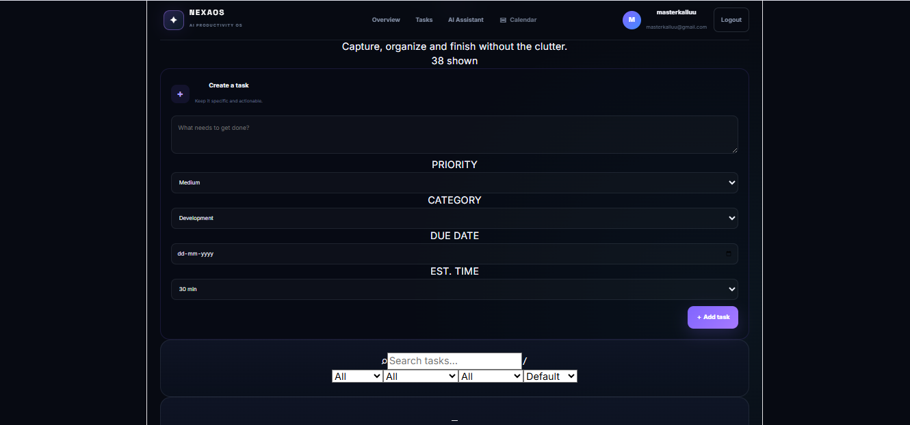

# NexaOS AI 🚀

> AI-powered productivity workspace for task management, planning, prioritization and intelligent productivity assistance.

NexaOS AI is a full-stack productivity application that combines a modern React frontend, a FastAPI backend and Groq-powered AI capabilities to help users manage tasks and improve their daily productivity through natural-language interaction.

---

## ✨ Features

### 📋 Task Management

- Create and manage tasks
- Add multiple tasks
- Mark tasks as completed
- Undo completed tasks
- Delete tasks
- View pending and completed tasks
- Track total, completed and pending task statistics

### 🤖 Nexa AI Assistant

- Natural-language interaction with Nexa AI
- Ask productivity-related questions
- Get practical productivity recommendations
- Generate daily plans
- Improve productivity
- Prioritize tasks
- Get task-management assistance

### ⚡ AI-Powered Task Operations

Nexa AI can assist with task-related operations through natural language:

- ➕ Add tasks
- ✅ Complete tasks
- ↩️ Undo completed tasks
- 🗑️ Delete tasks
- 🎯 Prioritize tasks
- 📋 Organize daily tasks

### 📊 Productivity Dashboard

- Total task count
- Completed task count
- Pending task count
- Task management interface
- AI assistant interface
- Productivity-focused dashboard

### 📱 Responsive Interface

- Clean modern UI
- Dark productivity-focused design
- Responsive layout
- Interactive task controls
- Integrated AI assistant

---

## 🛠️ Tech Stack

### Frontend

- React
- Vite
- JavaScript
- CSS
- Fetch API

### Backend

- Python
- FastAPI
- Pydantic
- Uvicorn

### Artificial Intelligence

- Groq API
- OpenAI GPT-OSS 120B

### Development Tools

- Visual Studio Code
- Git
- GitHub

---

## 🏗️ System Architecture

The application follows a full-stack architecture where the React frontend communicates with the FastAPI backend, which handles task operations and communicates with the Groq AI service.

---

## 📸 Screenshots

### 🏠 Dashboard


### 📋 Task Management



### 🤖 AI Assistant


---

## 📁 Project Structure

```text
NexaOS-AI/
│
├── backend/
│   ├── main.py
│   ├── ai_service.py
│   └── requirements.txt
│
├── frontend/
│   ├── src/
│   │   ├── App.jsx
│   │   ├── App.css
│   │   ├── index.css
│   │   └── main.jsx
│   ├── package.json
│   └── vite.config.js
│
├── screenshots/
│   ├── dashboard.png
│   ├── task-management.png
│   └── ai-assistant.png
│
├── .gitignore
├── README.md
└── requirements.txt
```

---

## 🚀 How to Run

### 1. Clone the repository

```bash
git clone https://github.com/kashishawasthiii/NexaOS-AI.git
cd NexaOS-AI
```

### 2. Backend Setup

```bash
cd backend
python -m venv venv
```

Activate the virtual environment.

**Windows:**

```bash
venv\Scripts\activate
```

Install dependencies:

```bash
pip install -r requirements.txt
```

Create a `.env` file inside `backend/`:

```env
GROQ_API_KEY=your_groq_api_key
```

Start the backend:

```bash
uvicorn main:app --reload
```

Backend will run at:

```text
http://127.0.0.1:8000
```

### 3. Frontend Setup

Open another terminal:

```bash
cd frontend
npm install
npm run dev
```

Frontend will run at:

```text
http://localhost:5173
```

---

## 🔐 Environment Variables

The project uses environment variables for API credentials.

```env
GROQ_API_KEY=your_groq_api_key
```

Never commit the `.env` file or expose API keys publicly.

---

## 🔮 Future Improvements

- Persistent database integration
- User authentication
- Personalized AI recommendations
- Task deadlines and reminders
- Calendar integration
- Productivity analytics
- Voice-based AI interaction
- Deployment using cloud infrastructure

---

## 👩‍💻 Author

**Kashish Awasthi**

NexaOS AI — AI-powered productivity workspace.

---

## 📄 License

This project is licensed under the MIT License.