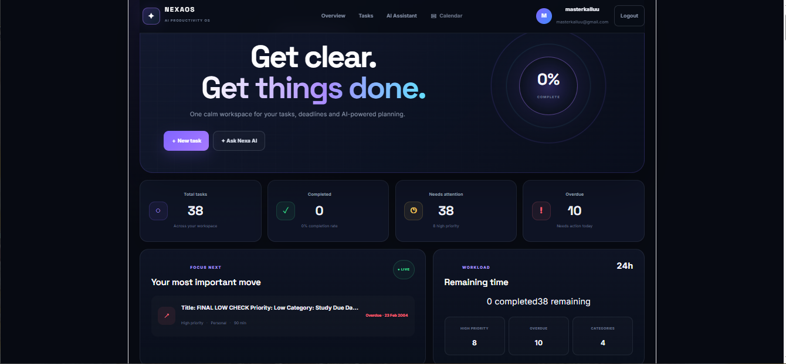
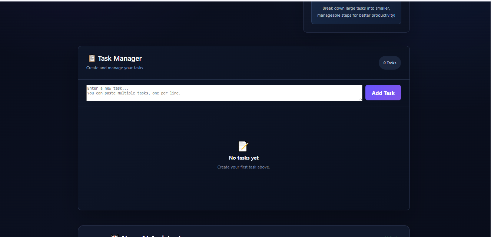
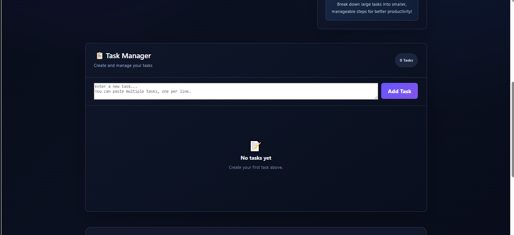

# NexaOS AI 🚀

> AI-powered productivity workspace for task management, planning, prioritization and intelligent productivity assistance.

NexaOS AI is a full-stack productivity application that combines a modern React frontend, a FastAPI backend and Groq-powered AI capabilities to help users manage tasks and improve their daily productivity through natural-language interaction.

---

## ✨ Features

### 📋 Task Management

- Create and manage tasks
- Add multiple tasks
- Mark tasks as completed
- Undo completed tasks
- Delete tasks
- View pending and completed tasks
- Track total, completed and pending task statistics

### 🤖 Nexa AI Assistant

- Natural-language interaction with Nexa AI
- Ask productivity-related questions
- Get practical productivity recommendations
- Generate daily plans
- Improve productivity
- Prioritize tasks
- Get task-management assistance

### ⚡ AI-Powered Task Operations

Nexa AI can assist with task-related operations through natural language:

- ➕ Add tasks
- ✅ Complete tasks
- ↩️ Undo completed tasks
- 🗑️ Delete tasks
- 🎯 Prioritize tasks
- 📋 Organize daily tasks

### 📊 Productivity Dashboard

- Total task count
- Completed task count
- Pending task count
- Task management interface
- AI assistant interface
- Productivity-focused dashboard

### 📱 Responsive Interface

- Clean modern UI
- Dark productivity-focused design
- Responsive layout
- Interactive task controls
- Integrated AI assistant

---

## 🛠️ Tech Stack

### Frontend

- React
- Vite
- JavaScript
- CSS
- Fetch API

### Backend

- Python
- FastAPI
- Pydantic
- Uvicorn

### Artificial Intelligence

- Groq API
- OpenAI GPT-OSS 120B

### Development Tools

- Visual Studio Code
- Git
- GitHub

---

## 🏗️ System Architecture

```text
                    ┌──────────────────────┐
                    │      User            │
                    │  Web Browser         │
                    └──────────┬───────────┘
                               │
                               ▼
                    ┌──────────────────────┐
                    │   React Frontend     │
                    │      + Vite          │
                    └──────────┬───────────┘
                               │
                         HTTP / JSON
                               │
                               ▼
                    ┌──────────────────────┐
                    │   FastAPI Backend    │
                    │      Python          │
                    └──────────┬───────────┘
                               │
                ┌──────────────┴──────────────┐
                │                             │
                ▼                             ▼
       ┌─────────────────┐          ┌─────────────────┐
       │  Task APIs      │          │   AI Service    │
       │  Task Management│          │   Groq API      │
       └─────────────────┘          └────────┬────────┘
                                             │
                                             ▼
                                  ┌────────────────────┐
                                  │ OpenAI GPT-OSS 120B│
                                  └────────────────────┘
                                  ```
                                  ## 📸 Screenshots

### 🏠 Dashboard



### 📋 Task Management



### 🤖 AI Assistant

